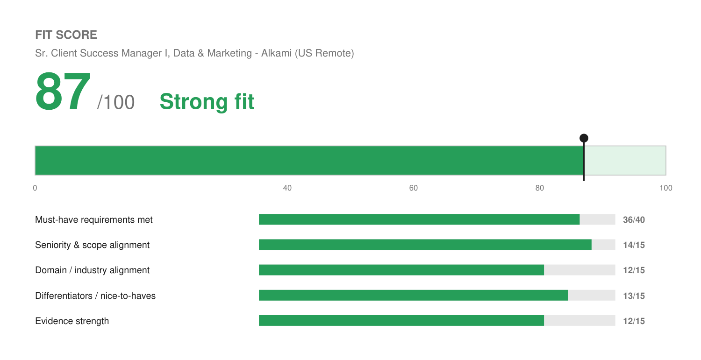

# Match Report — Sr. Client Success Manager I, Data & Marketing @ Alkami

| Field | Value |
| :--- | :--- |
| Company | Alkami Technology — digital banking platform for US banks and credit unions |
| Role | Sr. Client Success Manager I, Data & Marketing (JR-000808) |
| Location | US Remote |
| Comp (posted) | $102,000 – $114,000 |
| Source | Workday (JD pasted by Josh) |
| Date | 2026-08-10 |

---

## Fit Score

```
🟢 Fit Score: 87 / 100 — Strong fit
[█████████████████░░░]  87%
```



| Dimension | Score | Why |
| :--- | :--- | :--- |
| Must-have requirements met | 36 / 40 | Nine of ten required items met convincingly. Only Gainsight/Confluence specifically and programmatic advertising fall short, and both are named as examples rather than absolutes. |
| Seniority & scope alignment | 14 / 15 | Asks 5–7+ years for a senior IC managing a complex book independently. He has 15+ and has run portfolios at exactly this shape. Clean match. |
| Domain / industry alignment | 12 / 15 | SaaS, martech, and data-driven marketing are all direct hits — the product he would support *is* a data and marketing platform. Financial institutions and fintech are new, but listed only as preferred. |
| Differentiators | 13 / 15 | The rare CSM who can also build the campaign. Marketing ops and CRM architecture depth means his recommendations are executable, not theoretical. AI and automation depth on top. |
| Evidence strength | 12 / 15 | ~94% retention, 25% conversion improvement, 30% traffic, QBR frameworks, 25+ launches/month. Well matched to what this role measures. |
| **Total** | **87 / 100** | **Strong fit — his best-scoring role alongside the agency Senior AM. Apply.** |

---

## Keyword coverage

**28 of 33 required terms mirrored (85%).**

**Matched, and genuinely backed:** consultative partner · complex book of business · client success · account management · marketing strategy · data-driven marketing · campaign recommendations · optimization · portfolio prioritization · client sentiment and advocacy · usage and campaign analysis · ROI · executive/strategic business reviews (EBRs) · QBRs · multi-threaded relationships · executive stakeholders · champions · upsell and expansion · cross-functional coordination with Product, Marketing, Implementation and Support · renewal support · health reviews and risk identification · success plans · escalation · playbook documentation · Salesforce · Google Workspace · Jira · Slack · email, targeting and segmentation

**Deliberately not claimed (no profile evidence):** Gainsight · Confluence · programmatic advertising · predictive analytics · financial institution / digital banking / fintech experience

---

## Top strengths for this role

1. **The role's whole premise is his intersection.** "Client Success Manager, Data & Marketing" asks for someone who holds the relationship *and* can advise on marketing strategy. Most CSM candidates have the first half. He has both, and the cover letter leads on exactly that distinction.
2. **Retention with a number.** ~94% across a 15–20 account portfolio with $10K–$45K deals, driven by watching utilization for adoption gaps and intervening early. The JD's "execute renewal playbooks, health reviews, risk identification, path-to-green" is describing work he has done.
3. **EBRs are backed by the reporting underneath them.** He built the frameworks at Level Agency (ROI, CAC, LTV, conversion KPIs), not just the slides. The JD emphasizes tailoring content for senior decision-makers and connecting platform activity to ROI.
4. **He can actually advise on campaigns.** Segmentation, targeting, email, lifecycle, and CRO are all real for him. When a client's campaign underperforms, he can diagnose rather than escalate — which is the difference between a CSM this team wants and one they tolerate.
5. **Comp is right.** $102–114K is a sensible band for his experience and well above the LocaliQ posting for comparable client-facing scope.

## Top gaps

1. **No financial services or fintech background.** Banks and credit unions have a specific regulatory and competitive texture. Listed as preferred rather than required, so it is a disadvantage against other finalists rather than a filter.
2. **Gainsight, again.** Third posting in this batch to name it. Here it appears as "e.g., Gainsight, Salesforce" so Salesforce satisfies the requirement — but the pattern is now unmistakable and worth acting on (see below).
3. **No programmatic advertising.** Named in the required digital-marketing-tactics line and again under preferred. He has paid search and paid media but not programmatic buying.
4. **No predictive analytics or customer intelligence platform experience.** Preferred only.
5. **Travel up to 25%.** Not a gap, but a real condition worth confirming he is comfortable with before interviewing.

## Knockouts

**None.** All clear:

- **Location** — US Remote, and Alkami describes itself as remote-first. Arvada, CO is fine.
- **Work authorization** — "We cannot offer employment sponsorship." He is eligible to work in the US, so this passes.
- **Years** — 5–7+ asked, he has 15+.
- **Language** — no requirement.
- **Travel** — up to 25%, to confirm.

## Metrics needed

Nothing new. Two existing open items are directly relevant:

- **Solenzo portfolio size** and **Level Agency accounts** — both long-standing gaps. This JD stresses "independently managing a diverse portfolio... across varied sizes, complexities, and lifecycle stages," and a portfolio count is the natural proof. Still unrecorded.
- **Time-to-value** — would strengthen the retention story.

**Standing recommendation, now reinforced:** Gainsight has appeared as a named tool in three of the five roles reviewed in the last two batches (WWT as a hard requirement, Ready Rebound and Alkami as examples). Gainsight University offers free admin training. A certification would remove a recurring soft objection across the entire CS category, which is where his best-scoring roles are clustering.

## Referral prompt

**Worth pursuing.** Alkami is a ~1,000-person public fintech with an active LinkedIn presence and a stated remote-first culture, so second-degree connections are plausible. His Birdeye and Wix networks include plenty of people who moved into SaaS client success. Given no fintech background, an internal voice confirming he ramps fast on unfamiliar domains would neutralize the main objection.

## Output files

- `Joshua_Rotenberg_Resume.pdf` / `Joshua_Rotenberg_Resume.docx` — 2 pages, `LAST_PAGE_FILL=0.87`, modern style
- `Joshua_Rotenberg_Cover_Letter.pdf` / `Joshua_Rotenberg_Cover_Letter.docx` — 1 page, modern style
- `fit.json` / `fit.png` — Fit Score meter
- `resume.json` / `cover-letter.json` — editable source
