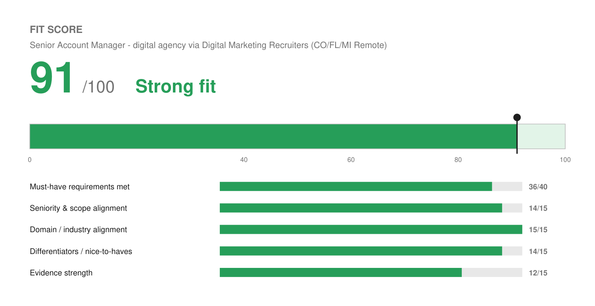

# Match Report — Senior Account Manager @ digital agency (via Digital Marketing Recruiters)

| Field | Value |
| :--- | :--- |
| Company | Unnamed digital marketing agency, 17-year track record — recruiting via Digital Marketing Recruiters |
| Role | Senior Account Manager, reporting to VP of SEO and Client Success |
| Location | Remote, M–F — **restricted to CO, FL, or MI residents** |
| Comp (posted) | $75,000 – $90,000 + bonus + benefits |
| Source | Loxo (JD pasted by Josh) |
| Date | 2026-08-10 |

---

## Fit Score

```
🟢 Fit Score: 91 / 100 — Strong fit
[██████████████████░░]  91%
```



| Dimension | Score | Why |
| :--- | :--- | :--- |
| Must-have requirements met | 36 / 40 | All seven required qualifications met, most of them strongly. The only softness is "enterprise or mid-market" portfolio scale — his books have skewed SMB and lower mid-market. |
| Seniority & scope alignment | 14 / 15 | Asks 4+ years; he has 15+. Senior IC owning the highest-value accounts, with a stated path into building the AM function — which matches his team-lead and founder history rather than overshooting it. |
| Domain / industry alignment | 15 / 15 | The only 15/15 awarded so far. This is a digital marketing agency hiring for SEO/paid/CRO/analytics client strategy. Level Agency and Fetch & Funnel are literally this job at this kind of company. |
| Differentiators | 14 / 15 | The AEO/GEO preference is a genuine edge — he builds LLM and agent systems daily, so AI-driven search is not a thing he would be reading up on. Plus founder-level process building against the "grow into leading the function" arc. |
| Evidence strength | 12 / 15 | ~94% retention, 30% traffic / 25% conversion, QBR frameworks, 25+ launches per month. Missing a portfolio size and a satisfaction/NPS figure, which the JD explicitly references. |
| **Total** | **91 / 100** | **Strongest fit to date. This is the one to prioritize.** |

---

## Keyword coverage

**26 of 30 terms mirrored (87%).**

**Matched, and genuinely backed:** account management · client strategy · client success · digital marketing agency · portfolio ownership · trusted advisor · VP and C-level stakeholders · strategic partner · SEO · paid media · CRO · analytics · GA4 · technical fluency · business narratives for non-technical executives · quarterly business reviews · KPI alignment · goal-setting · reporting and contextualization · account health · churn risk · client retention · upsell and expansion · scope and change orders · project management · cross-team coordination

**Deliberately not claimed (no profile evidence):** Shopify / Magento / BigCommerce · Looker Studio · ClickUp specifically · AEO/GEO as practiced discipline

---

## Top strengths for this role

1. **Perfect domain match.** Two of his last four roles were at digital marketing agencies doing this exact work — Level Agency as Account Executive / Client Strategist, Fetch & Funnel as AE / Sales Operations at a performance marketing agency. He does not need the agency model explained, including the awkward parts like managing expectations around organic performance timelines.
2. **Real channel fluency, not vocabulary.** The JD asks for "enough technical fluency in SEO, paid media, CRO, and analytics to be credible" with no execution expectation. He is well past that bar: he runs technical SEO audits and implements CMS fixes himself. The Google Ads cleanup followed by correctly diagnosing on-site CRO as the actual bottleneck is the single best interview story in his profile for this role, and it leads the cover letter.
3. **Retention and growth are quantified.** ~94% retention at Birdeye, expansion scoping at Solenzo. The JD's success criteria are retention, satisfaction, and closed expansion — all three are evidenced.
4. **The "longer view" fits him unusually well.** The role is designed to grow into building and leading the AM function. He led a team at Wix, helped take a new vertical from proof of concept to profitable including hiring and training, and has run his own practice for two years. Most candidates at 4–6 years cannot speak to that; he can.
5. **AI-driven search is a live edge.** AEO/GEO familiarity is listed as preferred. He works in LLM and agent systems daily. Few account managers can hold that conversation credibly right now.
6. **Location requirement already satisfied.** CO is on the approved list.

## Top gaps

1. **No named eCommerce platforms.** Shopify, Magento, and BigCommerce are all preferred and none are in the profile. He has Wix e-commerce segment experience, which is adjacent but not the same. Named honestly in the cover letter.
2. **Looker Studio.** He reports in GA4; Looker Studio is preferred and unevidenced. Low stakes.
3. **Portfolio scale.** "Enterprise or mid-market" — his books have skewed SMB (Wix, Birdeye) with mid-market at Accelo and Fetch & Funnel. Not disqualifying, but he should be ready to characterize the largest accounts he has personally held.
4. **No satisfaction score.** The JD asks for a "track record of... high satisfaction scores." He has retention numbers but no CSAT or NPS figure.
5. **ClickUp specifically** is named as the project environment. He uses Asana, Jira, Monday.com, and Notion. Trivially learnable and generally read as equivalent.

## Knockouts

**None — and the location restriction works in his favor.**

- **Location** — restricted to CO, FL, or MI residents. He lives in Arvada, CO, so he qualifies. Worth noting that this restriction *shrinks the applicant pool substantially*, which materially improves his odds relative to an open-nationwide posting.
- **Work authorization** — clear.
- **Years** — 4+ asked, he has 15+.
- **Schedule** — M–F, standard.

## Process notes

This is a recruiter-managed search, not a direct application. Digital Marketing Recruiters states their process includes resume screening, shortlisting, **video-recorded interviews**, possible **written assessments**, then client interviews. Two implications:

- Expect a recorded video screen early. Worth preparing the Google Ads / CRO diagnosis story as a spoken answer, since it is the one that demonstrates channel judgment fastest.
- The written assessment, if used, likely tests the QBR-narrative skill the JD emphasizes. That plays to his strengths.
- The agency client is unnamed in the posting, so the cover letter is addressed to the recruiting team and refers to "the agency" throughout. If Josh learns the client's name before applying, personalizing the first paragraph is worth the five minutes.

## Compensation note

$75,000–$90,000 + bonus is the lowest band of the two roles in this batch (Alkami posts $102–114K). Fit is higher here and there is a stated path to leading the function, so it is a genuine trade-off between near-term comp and trajectory rather than an obvious ranking.

## Metrics needed

Two items, one new:

- **Client satisfaction score (new).** The JD names "high satisfaction scores" as a required track record. He has retention but no CSAT, NPS, or equivalent from Wix, Birdeye, or Level. Adding to the profile's open list.
- **Portfolio size and largest account value** — existing open item, and this role's "enterprise or mid-market" language makes it pointed. Still unrecorded.

## Referral prompt

**Different play than usual.** The employer is unnamed, so there is nobody to get referred to yet. The leverage here is the recruiter: Digital Marketing Recruiters invites pre-application questions at inquiries@digitalmarketingrecruiters.com. A short note asking about the agency's client mix and portfolio scale before applying accomplishes two things — it surfaces whether the accounts are genuinely enterprise, and it puts his name in front of the recruiter as an engaged candidate rather than an inbound resume. Given they run the shortlist, that relationship *is* the referral.

## Output files

- `Joshua_Rotenberg_Resume.pdf` / `Joshua_Rotenberg_Resume.docx` — 2 pages, `LAST_PAGE_FILL=0.85`, modern style
- `Joshua_Rotenberg_Cover_Letter.pdf` / `Joshua_Rotenberg_Cover_Letter.docx` — 1 page, modern style
- `fit.json` / `fit.png` — Fit Score meter
- `resume.json` / `cover-letter.json` — editable source
