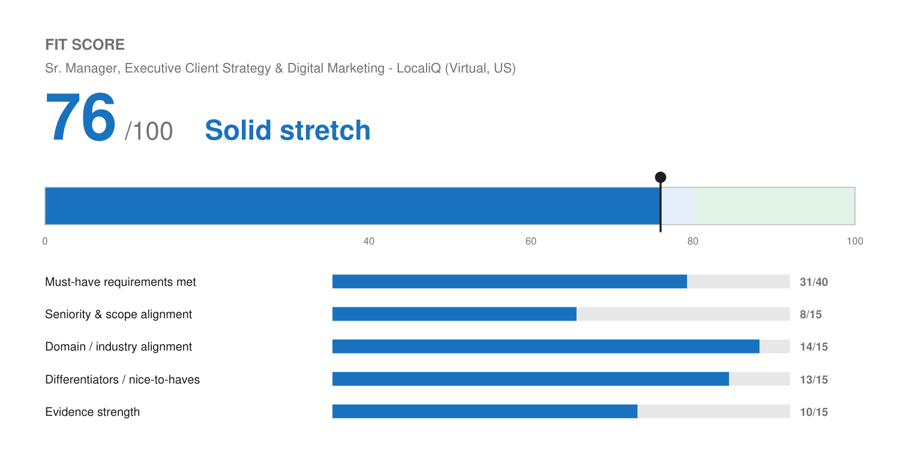

# Match Report — Sr. Manager, Executive Client Strategy & Digital Marketing @ LocaliQ

| Field | Value |
| :--- | :--- |
| Company | LocaliQ — digital marketing solutions brand of USA TODAY Co. (Gannett) |
| Role | Sr. Manager, Executive Client Strategy & Digital Marketing (Req #45892) |
| Location | Virtual · United States |
| Comp (posted) | $80,000 – $100,000 base, plus possible variable |
| Source | Dayforce / USA TODAY Co. Careers (JD pasted by Josh) |
| Date | 2026-08-10 |

---

## Fit Score

```
🔵 Fit Score: 76 / 100 — Solid stretch
[███████████████░░░░░]  76%
```



| Dimension | Score | Why |
| :--- | :--- | :--- |
| Must-have requirements met | 31 / 40 | The client-strategy half of the job is met convincingly. The people-leadership half is met one level down, and four named channels are unevidenced. |
| Seniority & scope alignment | 8 / 15 | The gap that defines this application. The role leads "a team of managers, senior strategists, and individual contributors across multiple client-facing pods" and owns workforce and succession planning. Josh has managed ICs directly, never a layer of managers. |
| Domain / industry alignment | 14 / 15 | The strongest domain match of anything tailored so far. LocaliQ sells digital marketing services to SMBs; Josh's entire career is performance agencies (Level, Fetch & Funnel), SMB SaaS (Wix, Birdeye, Fivestars), and his own digital services firm. |
| Differentiators | 13 / 15 | "Client Strategist" is literally in his Level Agency title. Add founder-level commercial judgment, AI and automation depth against their "champion innovation in automation" ask, and hands-on channel work most managers at this level have lost. |
| Evidence strength | 10 / 15 | Good retention and performance proof (~94%, 120%/110% attainment, 30%/25% at Wix), plus a written manager recommendation corroborating the team-building. Missing: team size, portfolio revenue, and any retention rate for a book of business at scale. |
| **Total** | **76 / 100** | **Solid stretch, top of the band — apply, and lead with the team-development evidence.** |

---

## Keyword coverage

**26 of 33 terms mirrored (79%).**

**Matched, and genuinely backed:** digital marketing strategy · PPC / Google Ads · SEO · paid media · client success · retention · portfolio growth · trusted advisor · executive business reviews · QBRs · performance standards · campaign execution · optimization · KPI attainment · measurement · attribution · reporting · automation · team management · coaching & development · talent development · hiring & onboarding · enablement / training · scalable processes · playbooks & operational standards · cross-functional partnership with Sales, Product and Operations

**Deliberately not claimed (no profile evidence):** paid social · CTV · display · video · campaign pacing · workforce planning · succession planning

Note the shape of that gap list: four are channels he has not run, and two (workforce and succession planning) are second-line management functions. Both clusters point at the same underlying gap — this is a bigger leadership seat than he has held.

---

## Top strengths for this role

1. **Domain fit is close to exact.** LocaliQ is digital marketing services for small and mid-sized businesses. That is the water Josh has swum in for fifteen years, from Fivestars and Wix through Birdeye and two performance agencies to Solenzo. He will not need the business model explained to him.
2. **The Wix team-building story is the best answer to the hardest question.** He managed and developed a team of onboarding specialists with budget, scope, and delivery ownership, and helped take a new vertical from proof of concept to a profitable business line — hiring, onboarding, training, and writing sales training for tenured AEs. It is corroborated in writing by his direct manager's LinkedIn recommendation, which is unusually strong evidence for a talent-development claim. It leads the Wix block for that reason.
3. **Executive client advisory is well evidenced.** C-Suite trusted-advisor work at Accelo, strategic lead on multi-stakeholder accounts at Level, high-value portfolio at Wix, plus the reporting frameworks (ROI, CAC, LTV, conversion KPIs) that make executive business reviews substantive rather than decorative.
4. **Retention is quantified.** ~94% partner retention at Birdeye with $10K–$45K deals, plus churn and adoption-gap analysis. The JD asks him to "leverage performance, retention, and profitability data to drive continuous improvement," and he has the retention half cold.
5. **Process and scale.** SOPs, playbooks, reporting-accuracy and handoff fixes at Fetch & Funnel, automated training sequences at Birdeye, 20+ workflow systems at Solenzo. Maps directly to "design and implement scalable processes, playbooks, and operational standards."

## Top gaps

1. **He has not managed managers.** This is the central issue and no amount of tailoring changes it. The role explicitly leads managers and senior strategists across multiple pods, and owns succession and workforce planning. His management experience is one layer down and the team size is not even recorded. Expect this to be the first screening question.
2. **Four named channels are missing: paid social, CTV, display, video.** LocaliQ sells all of them. He has PPC, SEO, and general paid media. CTV and video in particular are called out twice in the JD as innovation priorities. Not fatal for a leader who sets strategy rather than builds campaigns, but he should be able to talk credibly about how those channels are bought and measured.
3. **Team size is unrecorded.** "Managed a team of onboarding specialists" with no number attached is a materially weaker claim than "managed a team of six." This is already on the profile's open-numbers list and it matters more here than on any role so far.
4. **No portfolio revenue figure.** The role owns "a portfolio of our largest and most complex client relationships." He can describe the work but cannot size the book he has held.

## Knockouts

**None.** All clear:

- **Location** — Virtual, United States. Josh is in Arvada, CO, and no state restrictions are listed.
- **Work authorization** — Yes. The posting requires authorization in the applicable location; he qualifies.
- **Language** — No bilingual requirement.
- **Years / degree** — No formal minimum years or degree requirement stated in this posting.

**Compensation is the real flag, not a knockout.** The posted band is **$80,000–$100,000**, which is low for a role leading a layer of managers, and it is roughly half the Neo4j posting's band for comparable seniority. If the comp matters, ask early where in the band this lands and what variable is attached, because the title is doing more work here than the salary is.

**Application-channel warning from the posting itself:** USA TODAY Co. states that applications must be completed on their careers site via Dayforce, and that postings directing you elsewhere "may not be valid." Apply through gannett.com/careers directly rather than any job-board mirror.

## Metrics needed

Reinforcing an existing gap rather than adding a new one:

- **Team size at Wix** — already in *Numbers Worth Capturing* under highest leverage, still open. How many onboarding specialists he managed, and how many he hired or trained. For a role that leads managers across multiple pods, this single number is the difference between a vague claim and a credible one. It is the highest-value excavation target for this application by a wide margin.
- **Portfolio size and value** — how many accounts he held at Wix and Level, and the revenue they represented. Partially covered by existing open items (*Solenzo portfolio size*, *Level Agency accounts*), and this role adds a reason to size the Wix book too.

Three match reports have now flagged portfolio-size questions. A single `/excavate-profile` session covering team size, portfolio size, and meetings booked would clear the backlog behind all of them.

## Referral prompt

**Worth real effort here.** Gannett/USA TODAY Co. is a large, long-established employer with 400+ marketing and client-success staff across LocaliQ, so the odds of a second-degree connection are good — and LocaliQ's SMB digital services world overlaps directly with Josh's Birdeye, Wix, and agency network. Some ex-colleagues may well have landed there. Given that the people-leadership gap is the main obstacle, an internal voice vouching for how he ran the Wix team is worth more than anything on the resume.

## Output files

- `Joshua_Rotenberg_Resume.pdf` / `Joshua_Rotenberg_Resume.docx` — 2 pages, `LAST_PAGE_FILL=0.95`, modern style
- `Joshua_Rotenberg_Cover_Letter.pdf` / `Joshua_Rotenberg_Cover_Letter.docx` — 1 page, modern style
- `fit.json` / `fit.png` — Fit Score meter
- `resume.json` / `cover-letter.json` — editable source
