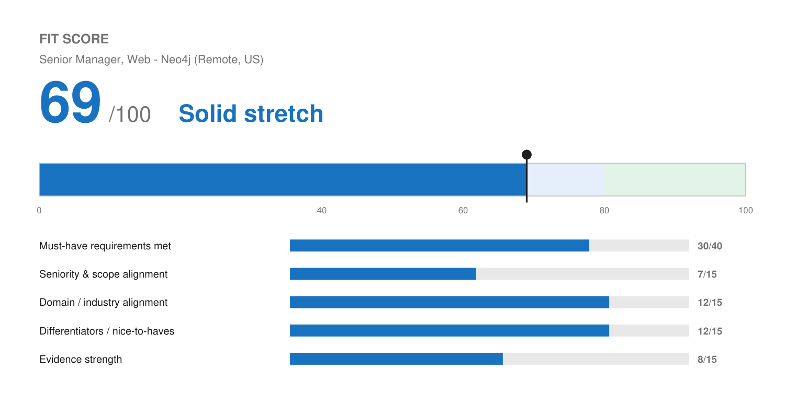

# Match Report — Senior Manager, Web @ Neo4j

| Field | Value |
| :--- | :--- |
| Company | Neo4j |
| Role | Senior Manager, Web |
| Location | Remote — United States |
| Comp (posted) | $150,000 – $185,000 base + stock options + benefits |
| Reports to | Head of Digital |
| Source | Greenhouse (JD pasted by Josh) |
| Date | 2026-08-10 |

---

## Fit Score

```
🔵 Fit Score: 69 / 100 — Solid stretch
[██████████████░░░░░░]  69%
```



| Dimension | Score | Why |
| :--- | :--- | :--- |
| Must-have requirements met | 30 / 40 | 5 of 8 stated requirements fully met, 3 partial. The 7+ years bar is cleared with margin. Analytics, A/B testing tooling, and enterprise-scale digital ecosystems are the partials. |
| Seniority & scope alignment | 7 / 15 | Biggest deduction. This is a Senior Manager owning a global corporate web presence at a $200M ARR company. Josh has led a team at Wix and runs his own firm, but has never held a manager title in-house nor owned an enterprise web property with regional stakeholders. |
| Domain / industry alignment | 12 / 15 | B2B SaaS, MarTech, and agency all check out. Wix is literally a website platform, which is the most on-point history he has. Graph/database and developer-audience marketing is new territory. |
| Differentiators | 12 / 15 | AI and agentic automation depth lands well at a company whose whole pitch is AI infrastructure. Founder experience, full-funnel range, hands-on builder rather than a pure strategist. |
| Evidence strength | 8 / 15 | The 30% traffic / 25% conversion pair is exactly the right kind of proof, but it is segment-level from 2020–2022. No A/B test results, no tag-management evidence, no site-scale numbers. |
| **Total** | **69 / 100** | **Solid stretch — worth applying with this tailored resume, materially better with a referral.** |

---

## Keyword coverage

**25 of 34 must-have terms mirrored (~74%).**

**Matched, and genuinely backed:** web strategy · site architecture · navigation and content structure · UX optimization · conversion rate optimization (CRO) · landing page optimization · competitive analysis · GA4 · conversion tracking · funnel analysis · user journey analysis · KPI dashboards · ROI reporting · engagement metrics · A/B testing · test-and-learn · hypothesis design · technical SEO · keyword gap analysis · SEM / Google Ads · paid media · agile workflows · Asana / Jira · cross-functional alignment · B2B SaaS

**Deliberately not claimed (no profile evidence — would be fabrication):** tag management / Google Tag Manager · Looker · Data Studio · Optimizely · Google Optimize · VWO · heat maps · click maps · session recordings · multivariate testing

That gap list is the honest shape of this application. Nine of the ten missing terms cluster in two buckets — the experimentation tool stack and the BI/tag layer — which is also where the interview will probe.

---

## Top strengths for this role

1. **The Wix traffic-and-conversion pair is the single best asset.** 30% traffic increase and 25% conversion improvement across the e-commerce segment is precisely the outcome Neo4j names under "Success in This Role." It leads the summary for that reason.
2. **Genuine full-funnel web work, not just strategy decks.** Technical SEO audits with fixes implemented in the CMS, Google Ads cleanup, then correctly diagnosing on-site CRO as the remaining bottleneck. That sequencing story is the strongest interview anecdote available and it is in the cover letter.
3. **Analytics that reach an executive audience.** GA4 tracking plus dashboards on funnel progression, campaign ROI, and pipeline velocity, presented to leadership. Maps directly to "Present strategy and results to stakeholders and leadership."
4. **Cross-functional liaison experience.** Level Agency (creative, media, analytics), Birdeye (Product and Engineering feedback into roadmap), Wix (hiring, training, process). The JD leans hard on stakeholder management and this is well covered.
5. **AI and automation depth.** Neo4j sells graph infrastructure for AI systems. A web lead who architects agent workflows and evaluation frameworks is an unusual and relevant profile, not just a buzzword match.

## Top gaps

1. **No enterprise / global corporate web ownership.** The JD assumes a multi-region site with regional marketing stakeholders. Josh's web scope has been client portfolios and his own firm. This is the real reason this is a 69 and not an 80.
2. **No named A/B testing platform.** Optimizely, VWO, and Google Optimize are all called out. He has done optimization and built evaluation frameworks, but not in these tools. Worth a weekend of hands-on time in VWO or Optimizely's free tier before an interview so the answer is "here is what I built" rather than "I could learn it."
3. **Tag management is unevidenced.** GTM is implied by "fluent in GA4, tag management, conversion tracking." If he has actually configured GTM containers and events, that belongs in the profile immediately — it is a one-line fix that closes a named must-have.
4. **No Looker or Data Studio.** He builds dashboards, but not in the tools named. Lower stakes than the other three; dashboard skill transfers and interviewers usually accept that.
5. **Title optics.** Three roles on the resume read "Account Executive." The headline and summary do the reframing work, but a skimmer scanning titles for a web leadership hire may pattern-match wrong. A referral largely neutralizes this.

## Knockouts

**None.** All clear:

- **Location** — Remote, United States. Josh is in Arvada, CO. No state exclusions in the posting.
- **Work authorization** — Yes, no sponsorship required.
- **Language** — English only, no bilingual requirement in the posting.
- **Minimum years** — 7+ required, he has 15+.

**Screening-question answers to use on the form:** worked at Neo4j before — No · legally able to work in region — Yes · require sponsorship now or in future — No · comfortable with BrightHire recording — Yes (declining flags nothing useful and the posting states it does not affect the outcome).

## Metrics needed

Added to *Numbers Worth Capturing* in the master profile this run:

- **A/B and experimentation volume** — tests designed and run at Level Agency, Wix, and Solenzo, and any measured lift. This is the highest-leverage missing number for this role and it will recur on every web, growth, and CRO posting.
- **Web / CMS scope** — number of sites or pages owned, redesigned, or migrated, and which CMS platforms. Directly answers the enterprise-scope doubt above.

Also worth a direct question, not a number: **has he hands-on configured Google Tag Manager** (containers, event tags, conversion goals)? If yes, it closes a named must-have and lifts the analytics dimension. If no, leave it off.

## Referral prompt

**Pursue one.** Neo4j is a well-networked Denver-adjacent-friendly remote employer and Josh's Wix, Birdeye, and agency network overlaps heavily with B2B SaaS marketing orgs. Worth 15 minutes on LinkedIn checking for first- and second-degree connections into Neo4j's marketing, digital, or web teams, and reaching out to the Head of Digital directly if the name is findable. At this fit level a referral is the difference between the pile and the shortlist.

## Output files

- `resume.pdf` / `resume.docx` — 2 pages, `LAST_PAGE_FILL=0.82`, modern style
- `cover-letter.pdf` / `cover-letter.docx` — 1 page, modern style
- `fit.json` / `fit.png` — Fit Score meter
- `resume.json` / `cover-letter.json` — editable source
