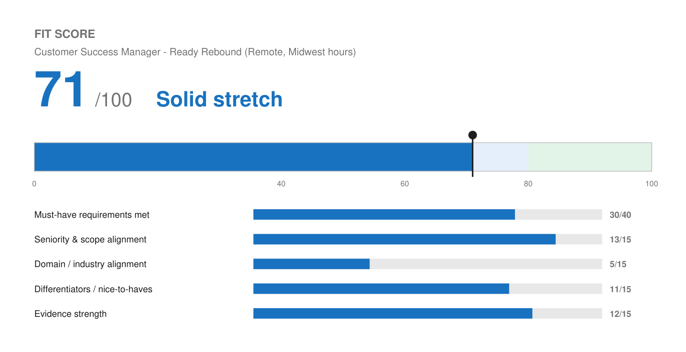

# Match Report — Customer Success Manager @ Ready Rebound

| Field | Value |
| :--- | :--- |
| Company | Ready Rebound — healthcare navigation for injured first responders |
| Role | Customer Success Manager (Client Experience) |
| Location | Milwaukee, WI · Remote · Full time — schedule listed as Midwest |
| Comp (posted) | Not disclosed |
| Source | Gusto job board (JD pasted by Josh) |
| Date | 2026-08-10 |

---

## Fit Score

```
🔵 Fit Score: 71 / 100 — Solid stretch
[██████████████░░░░░░]  71%
```



| Dimension | Score | Why |
| :--- | :--- | :--- |
| Must-have requirements met | 30 / 40 | Seven of eight generic CSM requirements met convincingly. The eighth — Workers' Comp carrier, TPA, or public sector HR experience — he fails entirely, and it is the one requirement that actually separates candidates here. |
| Seniority & scope alignment | 13 / 15 | Asks for 3+ years; he has 15+ with team-lead experience. Comfortably above the bar, and an IC portfolio role is a shape he has held repeatedly. |
| Domain / industry alignment | 5 / 15 | His weakest domain score across every role tailored so far. Healthcare navigation, workers' compensation, insurance, first responders, and municipal agencies are all new. |
| Differentiators | 11 / 15 | Deep onboarding and training background, automation skill that could improve their client experience processes, founder-level ownership, and comfort with non-technical stakeholders. |
| Evidence strength | 12 / 15 | Strong CS-specific proof: ~94% retention, 25+ launches/month at 110% of target, 25% conversion improvement, QBR frameworks. Well matched to what this role is measured on. |
| **Total** | **71 / 100** | **Solid stretch — the CSM craft is there; the industry background is not.** |

---

## Keyword coverage

**21 of 26 terms mirrored (81%).**

**Matched, and genuinely backed:** customer success · account management · trusted advisor · portfolio account management · client onboarding · implementations · long-term relationship management · adoption · utilization · renewals · churn risk mitigation · customer KPIs · ROI reporting · quarterly business reviews (QBRs) · training and education · data-driven insights · cross-functional collaboration with sales, product and operations · escalation · process improvement · Salesforce · CRM and customer success platforms

**Deliberately not claimed (no profile evidence):** Workers' Compensation · Third Party Administrator (TPA) · public sector HR · Gainsight · first responder / municipal agency experience

---

## Top strengths for this role

1. **Retention is quantified and directly on point.** ~94% retention across a 15–20 account portfolio with $10K–$45K deals is exactly the outcome this role is judged on, and it leads the summary.
2. **Onboarding and training at volume.** 25+ clients onboarded and launched per month at Wix against 110% of implementation targets, plus partner training programs at Birdeye. The JD calls for "training and education to client members and stakeholders" — he has done this at scale and built automated training sequences to make it repeatable.
3. **QBRs are real, not aspirational.** He built the reporting frameworks behind them at Level Agency (ROI, CAC, LTV, conversion KPIs) and reports on a regular cadence to executive stakeholders at Solenzo.
4. **Health-metric and adoption analysis.** Analyzing partner utilization to find adoption gaps and intervening before churn is precisely the "monitor, analyze, and report on customer KPIs" ask.
5. **Overqualified in a useful direction.** They want 3+ years; he brings 15+ plus team leadership. For a CSM seat that includes implementations and cross-functional work, that depth is an asset rather than a mismatch.

## Top gaps

1. **No Workers' Comp, TPA, or public sector HR experience.** This is listed as a flat qualification, not a "plus" — the first-responder and healthcare items are separately marked as a plus, which tells you the WC/TPA line is meant as a real filter. He fails it completely and no tailoring fixes it. This is the single reason the score is 71 rather than mid-80s.
2. **No healthcare or insurance domain at all.** Claims, navigation, provider networks, and the regulatory texture of workers' comp are all unfamiliar. Expect a steep learning curve and expect them to weigh it.
3. **Gainsight not used.** Named as an example alongside Salesforce, and softened by "or similar," so this is minor. Salesforce covers the requirement.
4. **Midwest schedule.** The posting lists the schedule as Full-Time (Midwest). He is Mountain time, one hour behind, which is workable but worth confirming rather than assuming.

## Knockouts

**None that are absolute, but one requirement he outright fails.**

- **Location** — Remote, listed against Milwaukee. Colorado should be fine; confirm there is no state restriction.
- **Work authorization** — Yes.
- **Language** — No bilingual requirement.
- **Years** — 3+ asked, he has 15+.
- **Workers' Comp / TPA / public sector HR** — **fails.** Treated here as a heavy must-have miss rather than a hard knockout, because it is industry background rather than a license or clearance, and because companies do flex on it when the CS fundamentals are strong. If their screening question is binary, this application ends there.

## Metrics needed

No new gaps specific to this role. Two existing open items would strengthen it:

- **Time-to-launch / time-to-value at Wix and Birdeye** — already on the profile's highest-leverage list. A CSM role selling speed-to-care would find a time-to-value number persuasive.
- **Training delivery volume** — sessions run and people trained at Wix and Birdeye, also already on the list. The JD explicitly asks for training client members and stakeholders.

## Referral prompt

**Low odds, but cheap to check.** Ready Rebound is a smaller, specialized company and unlikely to overlap Josh's SaaS and agency network. The higher-value play here is a direct note to the hiring manager acknowledging the workers' comp gap and making the case anyway — small companies read those, and the cover letter is already written to that posture.

## Output files

- `Joshua_Rotenberg_Resume.pdf` / `Joshua_Rotenberg_Resume.docx` — 2 pages, `LAST_PAGE_FILL=0.85`, modern style
- `Joshua_Rotenberg_Cover_Letter.pdf` / `Joshua_Rotenberg_Cover_Letter.docx` — 1 page, modern style
- `fit.json` / `fit.png` — Fit Score meter
- `resume.json` / `cover-letter.json` — editable source
