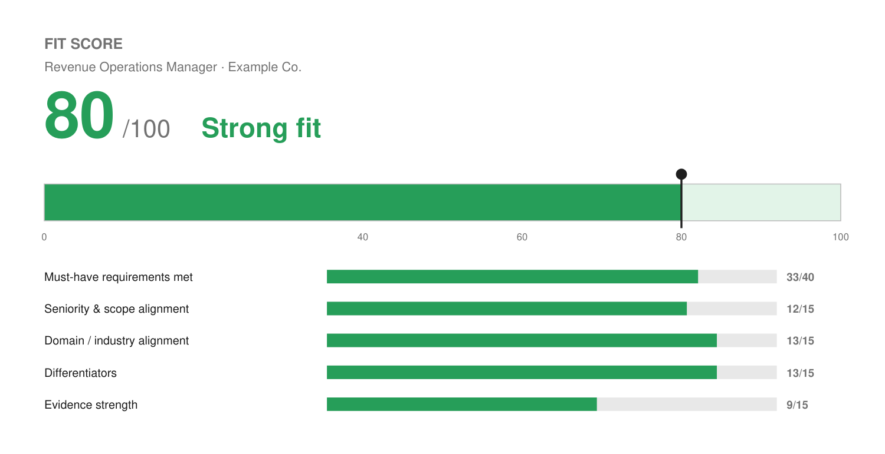

# Match Report — Revenue Operations Manager (SAMPLE)

> Illustrative example generated to demonstrate the tool's output. For a real run,
> the Fit Score and coverage are computed against the actual job posting.

| Field | Value |
| :--- | :--- |
| Role | Revenue Operations Manager |
| Company | Example Co. |
| Link | (paste job URL) |
| Date | 2026-06-17 |
| Work mode | Remote-friendly (no knockout) |

## Fit Score

```
🟢 Fit Score: 80 / 100 — Strong fit
[████████████████░░░░]  80%
```



**80 / 100 — Strong fit**

| Dimension | Score | Notes |
| :--- | :---: | :--- |
| Must-have requirements met | 33 / 40 | Strong on HubSpot/Salesforce CRM architecture, lifecycle automation, funnel/pipeline reporting, cross-functional alignment. Likely short on deep SQL and a named BI tool (Tableau/Looker) if required. |
| Seniority & scope alignment | 12 / 15 | Founder + Wix onboarding team lead cover people/budget/scope; title is "Manager," which fits. |
| Domain / industry alignment | 13 / 15 | Deep MarTech/SaaS/agency + B2B; vertical match depends on Example Co.'s space. |
| Differentiators / nice-to-haves | 13 / 15 | AI-driven automation, founder breadth, full-funnel ownership — genuinely differentiating right now. |
| Evidence strength | 9 / 15 | Solid Wix metrics (+30% traffic, +25% conversion), but RevOps-specific hard numbers are thin — biggest score lever. |
| **Total** | **80** | **Strong fit** — competitive; apply with this tailored resume and pursue a referral. |

**Knockouts:** none identified. (If the role required onsite outside Denver-metro, a
named clearance/license, or SQL as a hard must-have, fit would be capped/lowered.)

## Keyword coverage
- **Must-haves matched: 8 / 10** — HubSpot, Salesforce, lifecycle stages, lead routing,
  pipeline reporting, campaign ROI/attribution, GA4, cross-functional GTM alignment.
- **Not matched / gaps:** SQL (no evidence), a named BI tool (Tableau/Looker/Power BI).

## Top strengths for this role
1. End-to-end HubSpot/Salesforce CRM architecture with real data-hygiene discipline.
2. Reporting infrastructure leadership uses (funnel, ROI, pipeline velocity).
3. AI/automation fluency — a current differentiator in RevOps JDs.

## Top gaps to close
1. **SQL** — if listed as must-have, this is the main risk. Add a real, honest line only
   if Josh has used it; otherwise flag and consider a quick credential.
2. **Salesforce Admin cert** — highest-leverage add for RevOps targeting (per research).
3. **Quantified RevOps outcomes** — supply 1–2 real numbers (pipeline %, time-to-value,
   reporting-cycle reduction) to lift Evidence strength.

## Metrics needed (from Josh)
- A concrete RevOps result with a number (e.g., "cut reporting time X%," "grew SQLs Y%").

## Referral prompt
If you know anyone at Example Co., pursue a referral in parallel — referred candidates
are several-fold more likely to be hired than cold applicants.

## Files produced
- `Joshua_Rotenberg_Resume.pdf` (polished, ATS-safe, balanced 2 pages) + `Joshua_Rotenberg_Resume.docx` (editable)
- `Joshua_Rotenberg_Cover_Letter.pdf` + `Joshua_Rotenberg_Cover_Letter.docx`
