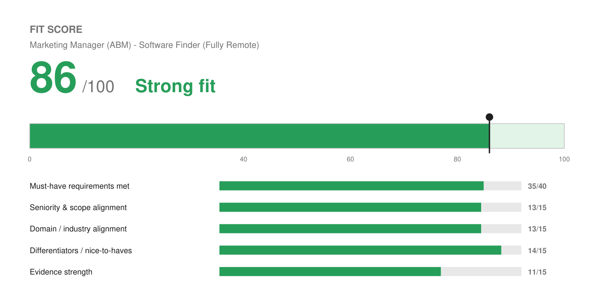

# Match Report — Marketing Manager @ Software Finder

| Field | Value |
| :--- | :--- |
| Company | Software Finder (B2B SaaS marketplace / review platform, founded 2019, 400+ staff) |
| Role | Marketing Manager — account-based marketing program for software vendors |
| Location | Spokane, WA · Fully Remote |
| Comp (posted) | Not disclosed |
| Source | Teamtailor (JD pasted by Josh) |
| Date | 2026-08-10 |

---

## Fit Score

```
🟢 Fit Score: 86 / 100 — Strong fit
[█████████████████░░░]  86%
```



| Dimension | Score | Why |
| :--- | :--- | :--- |
| Must-have requirements met | 35 / 40 | 6 of 8 fully met, 2 partial. Years, research ability, commercial judgment, writing, sales partnership, and HubSpot all clear cleanly. LinkedIn campaign tools are unevidenced and the degree is in the wrong field. |
| Seniority & scope alignment | 13 / 15 | Best alignment of any role tailored so far. Hands-on IC sitting between marketing and BD, no team to manage, measured on pipeline. That is precisely the shape of work Josh has done for 15 years. |
| Domain / industry alignment | 13 / 15 | B2B SaaS marketplace selling to software vendors. He has sold software to agencies (Accelo), run reseller partners on a reviews platform (Birdeye), and worked agency-side. Marketplaces specifically are new. |
| Differentiators | 14 / 15 | The automated audit-and-scoring engine is an unusually direct differentiator: an ABM research-and-personalization machine, already built and running. Founder-level commercial judgment on top. |
| Evidence strength | 11 / 15 | Strong, varied, quantified commercial proof. The deduction is that none of it is labeled "ABM program," and there is no meetings-booked or account-engagement number. |
| **Total** | **86 / 100** | **Strong fit — apply, and he is competitive here.** |

**This is a materially better fit than the Neo4j role (69).** Worth prioritizing.

---

## Keyword coverage

**24 of 30 must-have terms mirrored (80%).**

**Matched, and genuinely backed:** account-based marketing · target account selection · account prioritization · account segmentation & tiering · account scoring · personalized outreach · 1:1 / 1:few / 1:many campaigns · demand generation · qualified meetings · pipeline · appointment setting · lead qualification · lead scoring & routing · competitor research · keyword gap analysis · paid search / ad presence analysis · market positioning · commercial narratives · account briefs · HubSpot · CRM & marketing automation · sales and marketing orchestration · executive engagement · B2B SaaS

**Deliberately not claimed (no profile evidence):** LinkedIn campaign tools / LinkedIn Ads · intent data platforms · event-led account campaigns · webinars · benchmarking reports · ROI scenario modeling

---

## Top strengths for this role

1. **The audit-and-scoring workflow is the headline asset.** The JD asks for an account scoring model covering fit, maturity, competitive activity, and timing signals, and for personalization depth that tracks account value. Josh has already built the automated version of that at Solenzo: logic that scores a business's digital footprint and triggers personalized outreach, with 180+ contacts enrolled. Very few applicants for a Marketing Manager role will have built the engine rather than operated one.
2. **The AE background is an asset here, not a liability.** This role explicitly wants someone "comfortable working closely with sales and being measured on pipeline." Josh has five sales-side roles and hard numbers: ~$130K+ bookings at Fetch & Funnel, top three of 8–15 reps at Accelo while quota doubled. On the Neo4j web role those titles were a skim risk; here they are the qualification.
3. **Research-to-commercial-view is a direct match.** "Able to read a company website, ad presence and market position and form a commercial view quickly" maps almost word-for-word onto his competitor research, keyword gap analyses, and Google Ads diagnostic work.
4. **Review-platform and software-vendor fluency.** Birdeye is a reputation and reviews platform, and he ran 15–20 reseller partners there at ~94% retention. Accelo means he has sold software to agencies and professional-services firms. Software Finder's world is not unfamiliar.
5. **HubSpot is named and real.** The JD says "ideally HubSpot," and he has hands-on HubSpot client builds plus 5+ years of CRM and marketing automation architecture.

## Top gaps

1. **No event-led account campaigns.** An entire JD section covers the event motion: pre-event outreach, securing meetings before travel, attendee briefs, post-event campaigns. Nothing in the profile touches this. It is the single largest hole and he should expect to be asked.
2. **LinkedIn campaign tools unevidenced.** Named in the must-haves. He runs cold email and paid search but LinkedIn Ads / Sales Navigator campaign management is not in the profile. If he has used either, it should go in.
3. **No intent-data exposure.** Listed as preferred, not required. His scoring is CRM and workflow logic rather than 6sense/Bombora-class signals. Lower stakes, and the cover letter names it honestly.
4. **Degree field mismatch.** They ask for a bachelor's in marketing, business, "or a related field." His is B.A. Liberal Arts with a Political Science minor. He has the degree, just not the field. With 15+ years against a 5–7 year ask this rarely matters, and the Google Digital Marketing certificate helps. Not treated as a knockout.
5. **Nothing is labeled "ABM."** He has done the work; he has never held the title or run a formally tiered program with strategic/growth/programmatic buckets. Interview prep should include naming his practice in their vocabulary.

## Knockouts

**None.** All clear:

- **Location** — Fully Remote. Spokane, WA is the head office, not a requirement. Worth confirming there is no state restriction, since the posting does not list eligible states.
- **Work authorization** — Yes, no sponsorship required.
- **Language** — "Clear English" is the only language ask, so English-only is not a constraint here.
- **Minimum years** — 5 to 7 asked, he has 15+.

**One caution rather than a knockout:** a "5 to 7 years" band on a Marketing Manager title usually signals a comp range below what the Neo4j posting listed, and 15+ years can read as overqualified to a screener. No salary is posted. Worth asking about range early so the process does not burn time.

## Metrics needed

Additions and reinforcement for the profile:

- **Meetings booked / appointments set** — this JD is judged on qualified meetings, and the appointment-booking automation at Solenzo has no number attached to it. The 180+ enrolled contacts is an input metric, not an outcome. How many meetings did the workflow actually produce? This is the highest-value number for this application and it is not yet in *Numbers Worth Capturing*.
- **Solenzo portfolio size** — already on the list, still open. Relevant here as evidence of running many accounts in parallel.
- **Level Agency accounts and spend under management** — already on the list, still open.

Recurring signal: *Solenzo portfolio size* and *Level Agency accounts* have now been flagged across multiple match reports. Worth a `/excavate-profile` pass to clear the backlog, since both fix every future application at once.

## Referral prompt

**Worth a look, lower odds than usual.** Software Finder is Spokane-based with 400+ staff and less likely to overlap Josh's Denver and remote-SaaS network than a company like Neo4j. Still worth a LinkedIn scan for connections in their marketing or business development org. Since the role sits between marketing and BD, a BD-side connection is as useful as a marketing one, and applying early on a Teamtailor posting matters more than usual because those roles tend to fill from the first wave.

## Output files

- `Joshua_Rotenberg_Resume.pdf` / `Joshua_Rotenberg_Resume.docx` — 2 pages, `LAST_PAGE_FILL=0.93`, modern style
- `Joshua_Rotenberg_Cover_Letter.pdf` / `Joshua_Rotenberg_Cover_Letter.docx` — 1 page, modern style
- `fit.json` / `fit.png` — Fit Score meter
- `resume.json` / `cover-letter.json` — editable source
