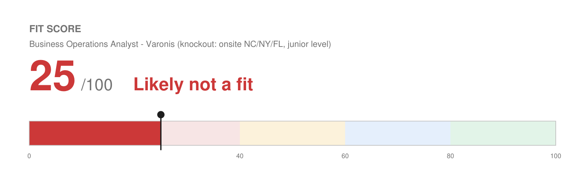

# Match Report — Business Operations Analyst @ Varonis

| Field | Value |
| :--- | :--- |
| Company | Varonis (Nasdaq: VRNS) — data security platform |
| Role | Business Operations Analyst (Sales) |
| Location | Morrisville, NC · New York, NY · Miami, FL — **no remote option stated** |
| Comp (posted) | Not disclosed |
| Source | Jobvite (JD pasted by Josh — submitted twice, items 3 and 4 are the same posting) |
| Date | 2026-08-10 |

---

## Fit Score

```
🔴 Fit Score: 25 / 100 — Likely not a fit
[█████░░░░░░░░░░░░░░░]  25%
```



**This score is a knockout cap.** On functional fit alone this would score around **62/100** — the sales-operations content matches him well. Two structural problems cap it:

1. **Location.** The posting lists three offices (Morrisville NC, New York NY, Miami FL) and says nothing about remote work. Josh's stated constraints are remote-US or the Denver/Colorado metro, with relocation a hard no. Unless Varonis will make this remote, the role is out of reach regardless of fit.
2. **Level.** "Minimum 1-2 years of work experience" is an entry-level bar. Josh has 15+. This is not a stretch role, it is a role two levels below him, and the comp will reflect that. Applying risks an immediate overqualification screen.

Either issue alone would be worth flagging. Together they make this the weakest use of his time in this batch.

---

## Keyword coverage

**19 of 25 terms mirrored (76%) — the functional match is genuinely good.**

**Matched, and genuinely backed:** sales operations · pipeline management · sales methodologies · pipeline health · dashboards and reports · operational metrics · ad hoc trend analysis · actionable insights for leadership · process improvement · bottleneck identification · playbook development · customer segmentation · account planning · rep training on tools and processes · CRM optimization · Salesforce · data integrity · cross-functional partnership with Marketing, Finance and Customer Success · SaaS / technology company experience

**Not claimed (no profile evidence):** advanced Excel · quantitative degree (Economics / Business / Finance) · comp plan design · territory management · hiring capacity modeling

---

## What would actually be strong here

Recording this because the functional fit is real and would apply to a remote, appropriately-levelled RevOps or Sales Ops role:

1. **He has held a Sales Operations title.** Fetch & Funnel was "Account Executive / Sales Operations," where he built the internal processes that improved reporting accuracy and reduced handoff errors — literally the "identify bottlenecks in sales workflows and recommend process improvements" ask.
2. **He understands pipeline from the inside.** Top three of 8–15 reps at Accelo while quota doubled. An analyst who has carried a number reads pipeline data differently from one who has not, and the JD wants someone credible with Sales Managers, Directors and VPs.
3. **Dashboards and CRM architecture.** Performance dashboards on funnel progression, ROI and pipeline velocity; CRM builds with lifecycle stages, lead routing and data-hygiene protocols. Maps to "build and maintain dashboards" and "maintain CRM accuracy and integrity."
4. **Rep training and enablement.** He developed sales training for tenured account executives at Wix.

**The honest read:** this is a good functional match at the wrong level in the wrong location.

## Top gaps

1. **Advanced Excel is unevidenced.** Called out explicitly. His profile lists Google Apps; Excel proficiency is not recorded. If he is in fact strong in Excel, that belongs in the profile — it is named on a large share of analyst postings.
2. **Degree field.** They ask for BA/BS "preferably with a quantitative focus (Economics, Business, Finance)." His is Liberal Arts with a Political Science minor. Soft preference, not a bar.
3. **No formal comp-plan or territory-design work.** Both are named responsibilities.
4. **Cybersecurity domain is new**, though the JD does not require it.

## Knockouts

- **Location — likely fails.** Three named offices, no remote language. This is the binding constraint. Worth one email to the recruiter asking whether the role is remote-eligible before doing anything else; some Jobvite postings list office anchors for roles that are in fact hybrid or remote.
- **Level mismatch — 1-2 years minimum against 15+ years.** Not a knockout in the formal sense, but a practical one.
- Work authorization and language are clear.

## Recommendation

**Skip, unless the recruiter confirms remote eligibility** and Josh is genuinely willing to take an analyst-level seat and salary. A tailored resume is in this folder if he wants to try, but the better move is to use this posting as a template: the same resume works for **remote, mid-level Revenue Operations or Sales Operations Analyst roles**, which are a strong match for him and worth a targeted `/find-roles` run.

## Metrics needed

One concrete addition worth capturing:

- **Excel proficiency (a capability question, not a number).** Named as "advanced Excel" on this posting and common across analyst roles. If he has real Excel depth — pivot tables, lookups, modeling — it should be in the profile's tools list, which currently names only Google Apps. Currently he is losing a named must-have to an omission rather than to an actual gap.

## Output files

- `Joshua_Rotenberg_Resume.pdf` / `Joshua_Rotenberg_Resume.docx` — 2 pages, `LAST_PAGE_FILL=0.69`, modern style
- `fit.json` / `fit.png` — Fit Score meter
- `resume.json` — editable source
- No cover letter generated (not requested by the posting, and the location knockout makes it low-value)
