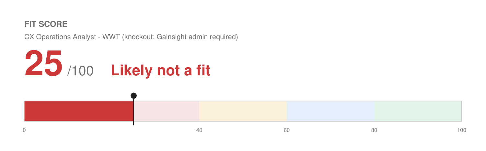

# Match Report — Customer Experience Operations Analyst @ WWT

| Field | Value |
| :--- | :--- |
| Company | World Wide Technology (WWT) |
| Role | Customer Experience Operations Analyst (#26-2408) |
| Location | Remote — Nationwide, United States |
| Comp (posted) | $65,000 – $80,000 base, plus possible variable |
| Source | WWT careers (JD pasted by Josh) |
| Date | 2026-08-10 |

---

## Fit Score

```
🔴 Fit Score: 25 / 100 — Likely not a fit
[█████░░░░░░░░░░░░░░░]  25%
```



**This score is a knockout cap, not a sum of dimensions.** On the underlying rubric this role would score roughly **52/100** — the customer-lifecycle-operations craft is genuinely there. The cap applies because the posting states **"Gainsight administration experience required,"** and the role is not merely a job that uses Gainsight; it *is* the Gainsight administrator seat. Two of the two named "key areas of focus" are Gainsight administration and Gainsight-based digital journey mapping, and the responsibilities enumerate specific modules (Journey Orchestrator, Data Designer, Rule Management, Dashboards). Josh has never used the platform.

No amount of resume tailoring changes that, and the first screening question will be some version of "how long have you administered Gainsight."

---

## Keyword coverage

**14 of 24 terms mirrored (58%) — and the missing ones are the load-bearing ones.**

**Matched, and genuinely backed:** customer lifecycle management · platform configuration · workflow and rule creation · dashboards · reporting accuracy · data integrity · digital journey mapping · digital touchpoints · automation · scale · cross-functional requirements gathering · training team members · data analysis · operationally minded

**Not claimed (no profile evidence):** Gainsight · Journey Orchestrator · Data Designer · Gainsight rule management · survey design and measurement · Cisco · VMware · Microsoft · Dell EMC · other OEM experience

Note that the unmatched list contains both explicit qualifications: Gainsight administration *and* "past work experience with Cisco, VMWare, Microsoft, Dell EMC and other OEMs." He has neither. That is two of nine stated qualifications missed, but they are the only two that are concrete and verifiable — the rest ("strong organization skills," "operationally minded," "common sense approach") are dispositional and everyone claims them.

---

## What would actually be strong here

Worth recording, because it explains the ~52 underlying score and would transfer to a similar role on a platform he knows:

1. **He is a platform administrator, just not this platform.** He architected and runs a 20+ workflow automation system covering lead capture, tagging, routing, qualification, booking, no-show recovery, onboarding nurture, reactivation, and review generation, plus CRM builds in GoHighLevel and HubSpot with lifecycle stages and data-hygiene protocols. That is the same job description with a different vendor name.
2. **Digital journey mapping is real work he does.** Designing lifecycle sequences across touchpoints is the core of his Solenzo practice.
3. **Reporting and data integrity.** Dashboards on funnel progression and ROI, plus documented, auditable records across concurrent engagements.
4. **Training and enablement.** Hands-on training on new technology stacks, automated product-training sequences at Birdeye, new-hire training at Wix.

**The honest read:** if WWT would consider a strong CS-ops generalist who would learn Gainsight, he is a credible candidate. If the requirement is literal, he is filtered in the first pass.

## Other considerations

- **Comp is $65,000–$80,000** for an analyst seat. That is well below the other roles in this batch and a step down in scope from 15 years of experience.
- **Domain is unfamiliar.** WWT is an enterprise IT integrator and the OEM ecosystem (Cisco, VMware, Dell EMC) is a world he has not worked in.

## Knockouts

- **Gainsight administration experience — required, and absent.** This is the binding constraint.
- **OEM experience (Cisco / VMware / Microsoft / Dell EMC) — listed as a qualification, and absent.**
- Location, work authorization, and language are all clear. Remote nationwide works from Arvada.

## Recommendation

**Skip unless he has a special angle** — an internal referral who can vouch that Gainsight is learnable in the seat, or a genuine interest in enterprise IT that makes the pay cut worth it. A tailored resume is included in this folder so he can apply if he wants to test it, but the realistic expectation is a first-pass filter.

**If he does want to pursue Gainsight-shaped roles generally,** the fix is concrete: Gainsight offers free admin training and certification through Gainsight University. A certification would convert this from a knockout into a stretch across a whole category of CS-ops postings, which are otherwise a good match for his profile.

## Metrics needed

Nothing role-specific. The generic open item that would help across CS-ops roles is **concurrent workload at Solenzo** (already on the profile list) — platform-admin roles want to know how many systems and clients he supports at once.

## Output files

- `Joshua_Rotenberg_Resume.pdf` / `Joshua_Rotenberg_Resume.docx` — 2 pages, `LAST_PAGE_FILL=0.73`, modern style
- `fit.json` / `fit.png` — Fit Score meter
- `resume.json` — editable source
- No cover letter generated (not requested by the posting, and the knockout makes it low-value)
